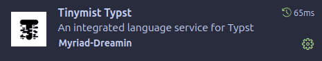

<div align="left">
  
</div>

&nbsp;

# VUT FIT - Protocol Template

Unofficial [Typst](https://typst.app) (Modern LaTeX alternative) template for the VUT FIT project protocols.

Good enough to bootstrap your protocols. Definitely not good enough for your Thesis.

## How to use

#### 1. Copy the important files

- `template.typ`
- `assets/`

#### 2. Import the template in your typst file

```typst
#import "template.typ": FIT-Protocol

#show: FIT-Protocol.with(
  academic-subject: "SUBJECT NAME",
  academic-year: "2024/2025",
  protocol-title: "SEMESTRAL PROJECT",
  protocol-subtitle: "Project subtitle",
  authors: (
    (name: "Honza Novák", login: "xlogin00"),
  ),
  date: "Brno, 19. dubna 2025",
)

// ... continue here
```

You can take a look into `main.typ` for usage examples. The output is `main.pdf`.

### Offline - VSCode

Install this extension which allows you to work localy.

This is recommended by me.



### Online - Typst.app

Sign in to [typst.app](https://typst.app) to create a collaborative online project and upload the files manually
