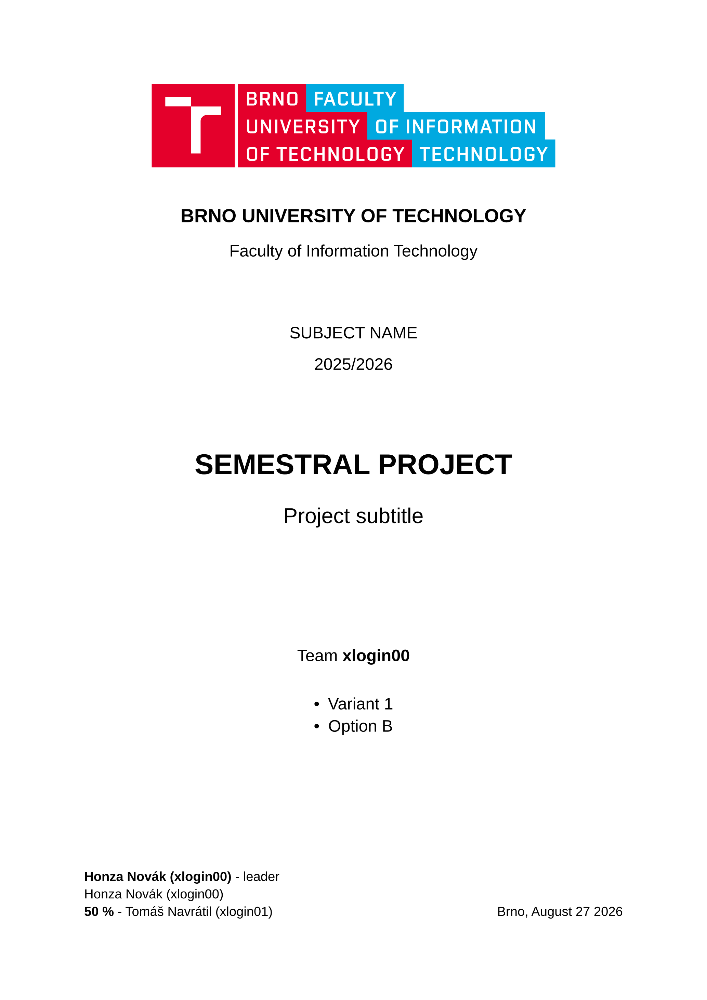
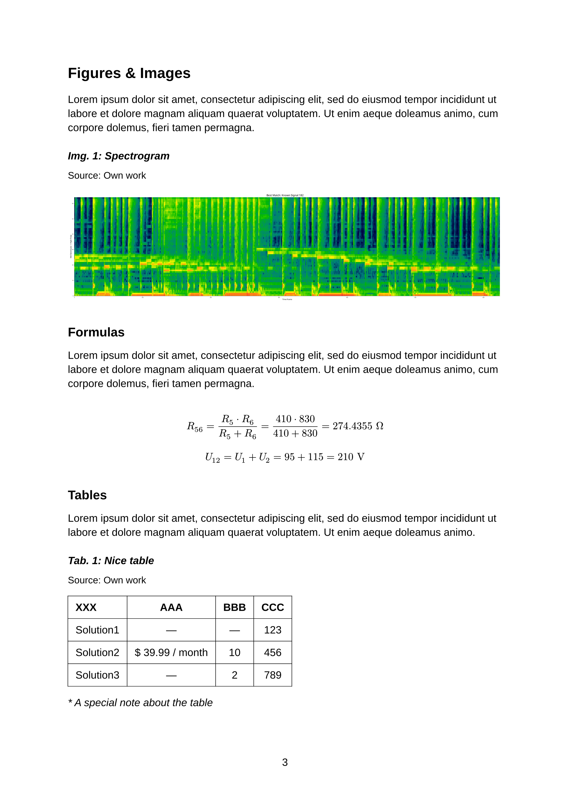
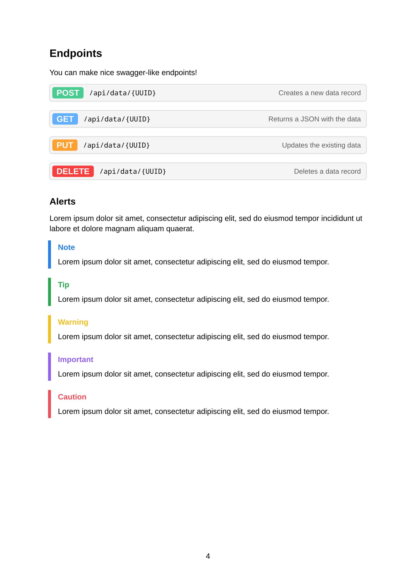
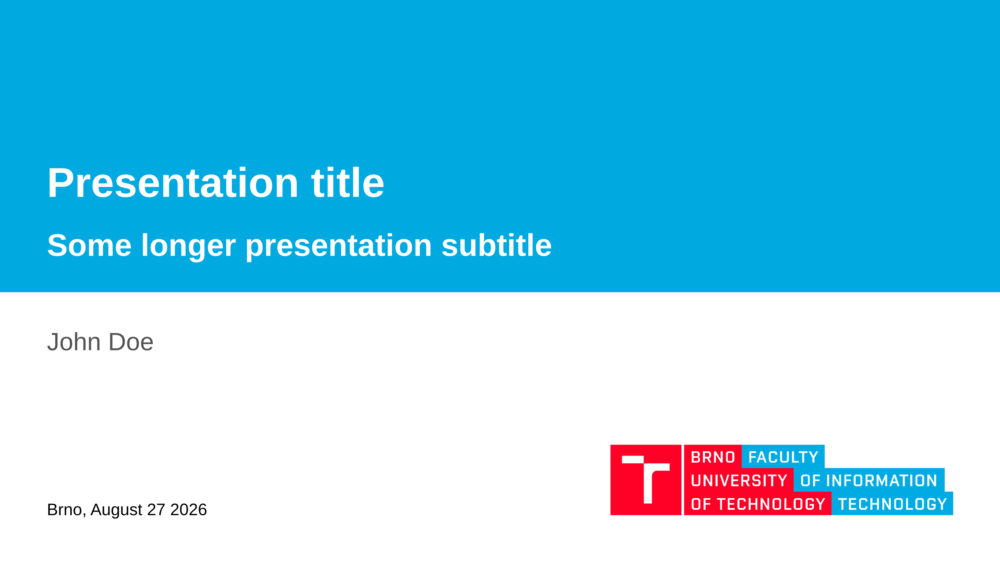
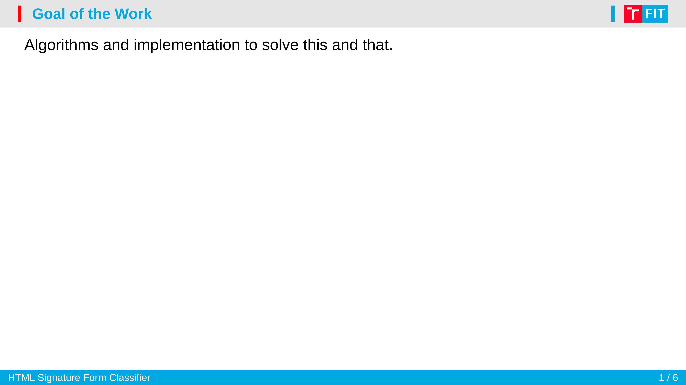
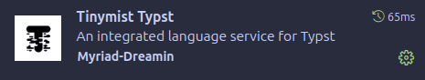

<div align="left">
  
</div>

&nbsp;

# VUT FIT - Typst Templates

Unofficial [Typst](https://typst.app) (Modern LaTeX alternative) templates for the VUT FIT project protocols and presentations.

Good enough to bootstrap your protocols and slides. Definitely not good enough for your Thesis.

<div align="center">
  
  
  
</div>

<div align="center">
  
  
</div>

## FIT-Protocol

#### 1. Copy the important files

- `template.typ`
- `sources.yaml`
- `assets/`

#### 2. Import the template in your typst file

```typst
#import "template.typ": FIT-Protocol

#show: FIT-Protocol.with(
  academic-subject: "SUBJECT NAME",
  protocol-title: "SEMESTRAL PROJECT",
  protocol-subtitle: "Project subtitle",
  authors: (
    (name: "Honza Novák", login: "xlogin00"),
  ),
)

// ... continue here
```

You can take a look into `main.typ` for usage examples. The output is `main.pdf`.

## FIT-Presentation

A presentation template recreating the official FIT slide template.

#### 1. Copy the important files

- `template.typ`
- `sources.yaml`
- `assets/`

#### 2. Import the template in your typst file

```typst
#import "template.typ": FIT-Presentation, title-slide

#show: FIT-Presentation.with(
  language: "EN",
  presentation-title: "Presentation title",
  presentation-subtitle: "Some longer presentation subtitle",
  work-title: "HTML Signature Form Classifier",
  authors: (
    (name: "John Doe"),
  )
)

// ... continue here
```

Slides are driven by `==` headings (level 2) - each becomes a content slide with a cyan title and the FIT footer bar. `= Section` (level 1) creates a section divider. You can take a look into `slides.typ` for usage examples. The output is `slides.pdf`.

### Offline - VSCode

Install this extension which allows you to work localy.

This is recommended by me.

[](https://marketplace.visualstudio.com/items?itemName=myriad-dreamin.tinymist)

### Online - Typst.app

Sign in to [typst.app](https://typst.app) to create a collaborative online project and upload the files manually
